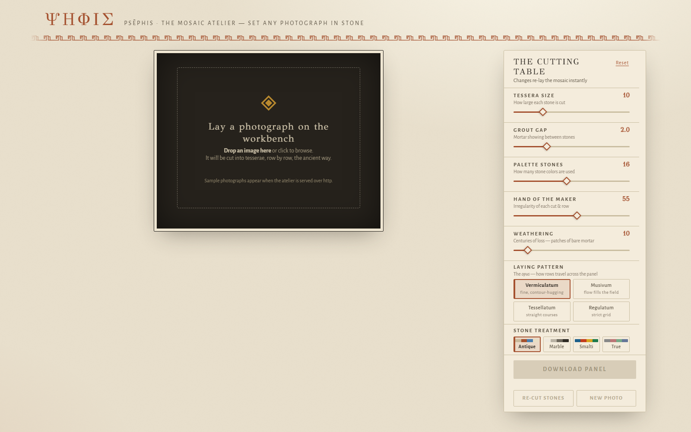

# ΨΗΦΙΣ · Psēphis — the mosaic atelier

Turn any photograph into an ancient Greek/Roman mosaic, in the browser.
One HTML file. No build, no server, no dependencies.

**Live app:** https://nirshribman-byte.github.io/psephis/



## What it does

This is not pixelation — it lays tesserae the way ancient workshops did:

- **Andamento** — a structure-tensor flow field makes rows of stones follow the
  contours of the subject and flow with the image's own large-scale structure
  in the background.
- **Outline courses first** — dark tesserae are traced along strong edges and
  the sky/ground horizon before the field is filled, so figures stay crisp
  (*opus vermiculatum*).
- **Adaptive cutting** — stones are cut finer near contours, coarser in open
  fields, like real emblemata.
- **Stone trays** — the palette is k-means quantized, then idealized toward
  period materials: Aegean blues for sky, serpentine greens for vegetation,
  limestone neutrals. Inside the sky only sky-tray stones may be laid.
- **Four laying patterns (opera)** — Vermiculatum, Musivum, Tessellatum,
  Regulatum — and four stone treatments: Antique, Marble, Smalti, True tone.
- **Weathering** — contiguous patches of bare lime mortar, like excavated
  fragments.
- **Fidelity mode (wallpaper)** — a 0–100 slider from *free ancient palette*
  to *photo-true stones*: each tessera is tinted toward the photograph's true
  local tone, grout takes the image's own local color, specular highlights
  (the sun, glints) survive as bright accent stones, still skies lay in long
  calm courses, and dusk scenes keep their color in the shadows. Full detail,
  still unmistakably stone — made for backgrounds and wallpapers (1920px export,
  tesserae down to size 4).

## Use it

Open `index.html` (or the live link), drop a photograph on the workbench,
and adjust the Cutting Table. Everything re-lays live; hold the canvas
(or press <kbd>C</kbd>) to compare with the original, click to zoom,
download the finished panel as PNG.

### URL parameters (automation / reproducibility)

```
index.html#img=<url>&size=10&gap=2&pal=16&fid=0&irr=55&age=10&style=antique&lay=vermiculatum&seed=123
```

`window.__renderDone === true` signals a finished full-resolution render —
handy for headless screenshots.

## How it works (short version)

1. Sobel → structure tensor → smoothed orientation field (edge tangents near
   contours, wide-blur image flow in the field).
2. Chamfer distance from strong edges gates everything: outline pass, tile
   size, palette behavior.
3. Streamline placement (Jobard–Léfer style) with an occupancy grid;
   every placed stone seeds neighboring rows.
4. Per-tile: median-side color sampling (no averaging across boundaries),
   nearest palette stone with edge-gated course coherence, jittered quad with
   bevel lighting, grout and grain on top.

Built with plain canvas 2D. ~1,200 lines, one file.
